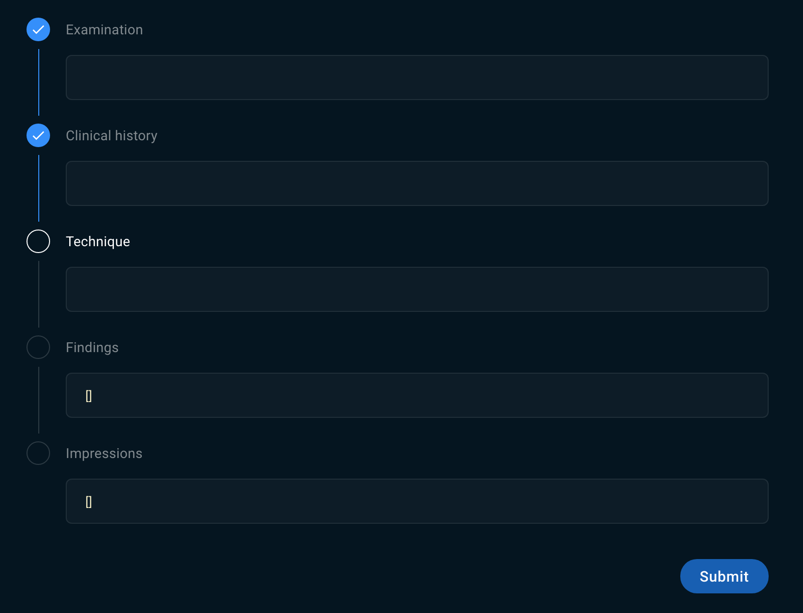

# Sirona Medical - Technical Interview

👋🏼 Welcome! Today we'll be building a small React component. This component, or something like it, is actually in our live production application.

You'll be given the requirements for the component one-by-one. Once you pass the 'test' for a requirement, a new requirement will be added.

Keep your code clean. Think about solutions that can reduce the amount of logic needed to satisfy the requirements. (Keep it DRY!)

Use whatever resources you're familiar with (Google, MDN, React docs, SO, etc.) to get the job done.

#### Requirement #1: A user should be able to submit information through a form.

1. This form should have a text-area (`<textarea />`) with a label for each of the following items (Examination, Clinical History, Technique, Findings, Impressions) - You will find the list, in array form, at the top of the `src/App.tsx` file.

2. Add a single "Submit" button beneath the 5 text-areas. When the button is clicked, the component should log the text of each of the text-area fields.

   The schema for the log output should be like the following:

   ```
   { examination: 'text', clinicalHistory: 'text', etc... }
   ```

#### Requirement #2: A user should have a styled indication of fields they've touched.

The design team has provided a mock-up for the component:



1. Add a circle to the left of each text-area's label.
2. The text-area and circle outlines will be gray by default.
3. Only when focused, their outlines should turn white.
4. When a text-area is blurred, its associated label should turn gray and the circle next to the label should turn blue and show a check symbol (✓) inside it.

#### Requirement #3: The form fields should resize according to the amount of input text.

1. All text input in the text-area fields should be visible. The text-areas will need to expand when new text is added, and shrink (down to default or some defined minimum) when text is removed.

#### Requirement #4: Users should receive a notification after they've submitted.

1. When the "Submit" button is pressed, a toast notification should appear in the upper-right corner of the page.
2. The text should read _"Your report has been successfully submitted"_ and the notification should fade away after 3 seconds.
